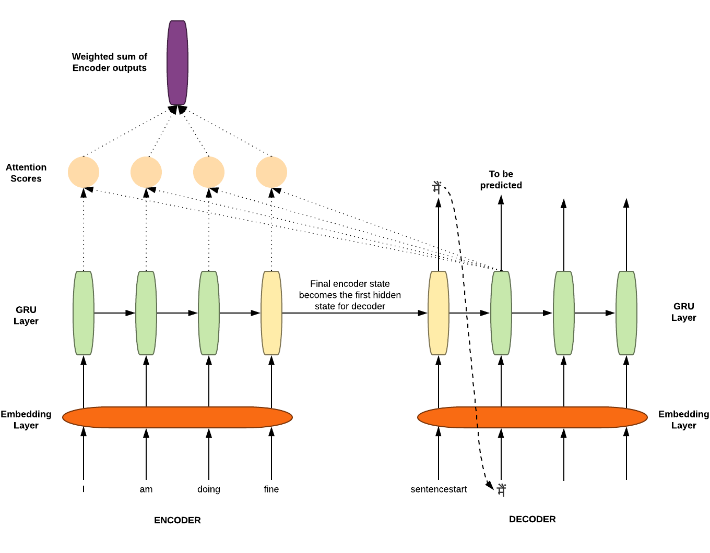
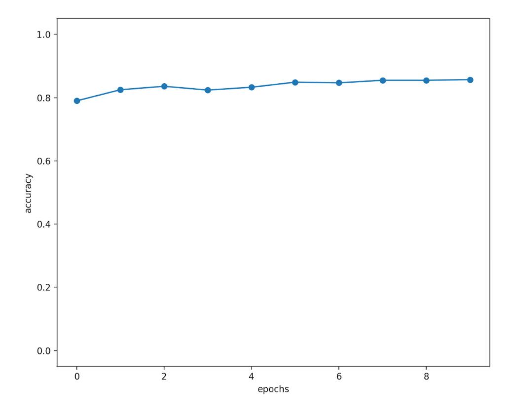

English To Chinese
====

**以具有 Attention 機制的 GRU 網路，以近 19 萬筆語料訓練模型，藉由所得之模型，準確作中文翻譯為英文之工具。**

**模型架構

from [Ayush Jain May 22, 2020](https://towardsdatascience.com/intuitive-understanding-and-step-by-step-implementation-of-sequence-to-sequence-model-with-86be00ebe0fd)

訓練方式
----
### 訓練環境
+ Ubuntu 20.04
+ NVIDIA RTX 3080 10G
+ Python 3.8
+ Cuda Toolkit
+ 使用框架：Pytorch / Pytorchtext

### 訓練程序
1. 建立 word vocabulary
2. 使用 word2vec 演算法實作 Word Embeding
3. 使用 GRU 產生 hidden state
4. 使用 Attention 注意 GRU 的 hidden state
5. 使用 Affine 全連接層
6. 計算 Loss
7. Backword 修正 Gradient
8. 完成 100 epochs
9. 超參數設定 (Hyperparameters setting)
	+ Batch Size: 512
	+ Max Epoch: 100
	+ Word Vector Size: 256
	+ Max Grad: 5
	+ Hidden Size: 512
	+ Dropout 0.5

### 訓練成果統計圖

